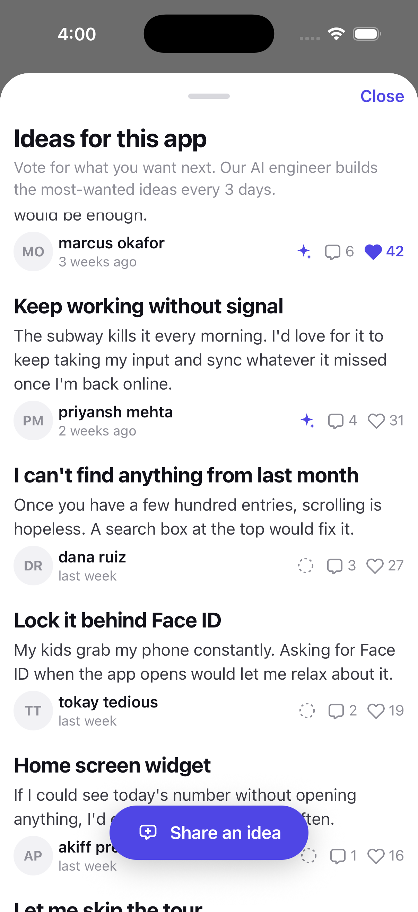
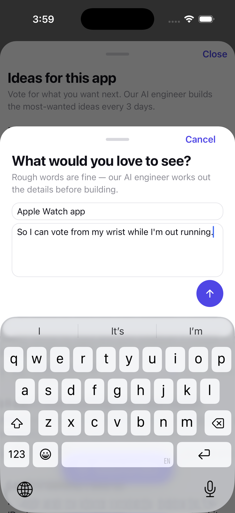
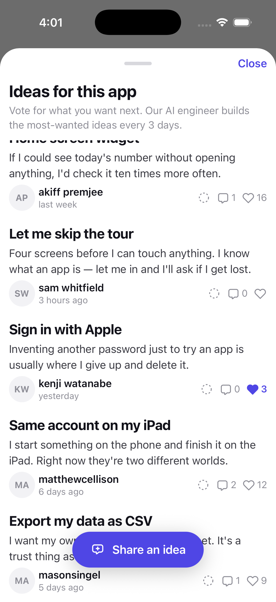
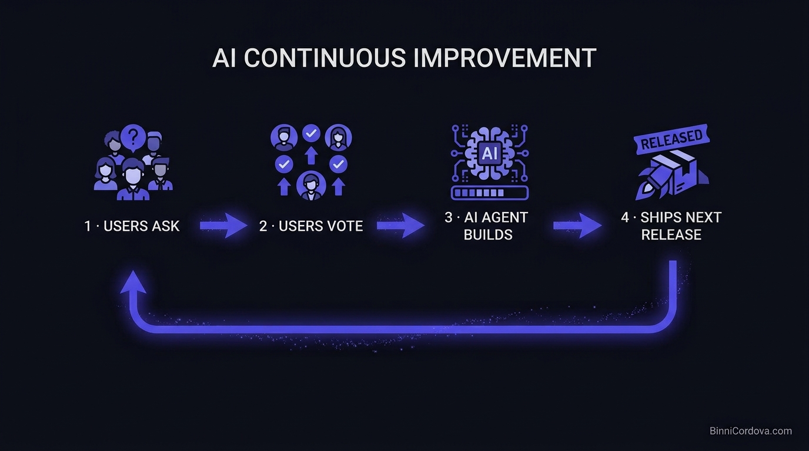
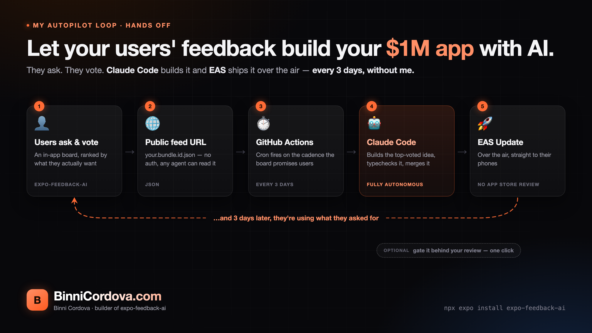
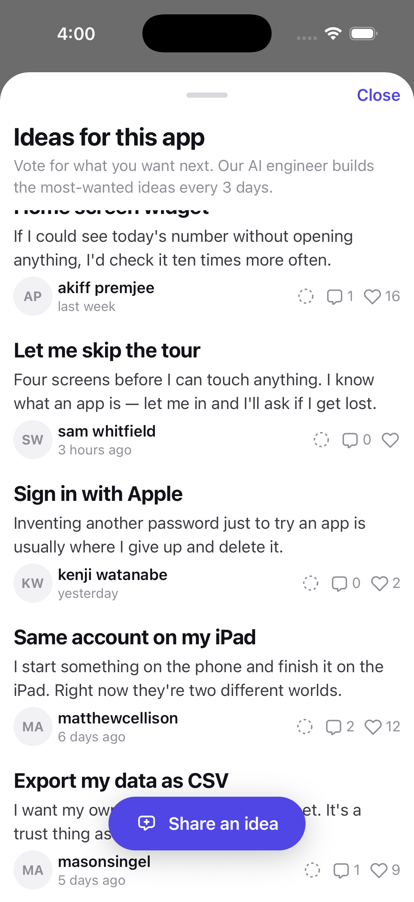
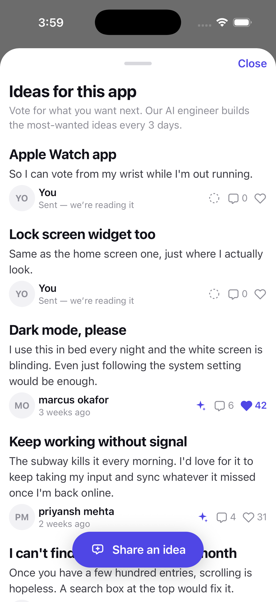
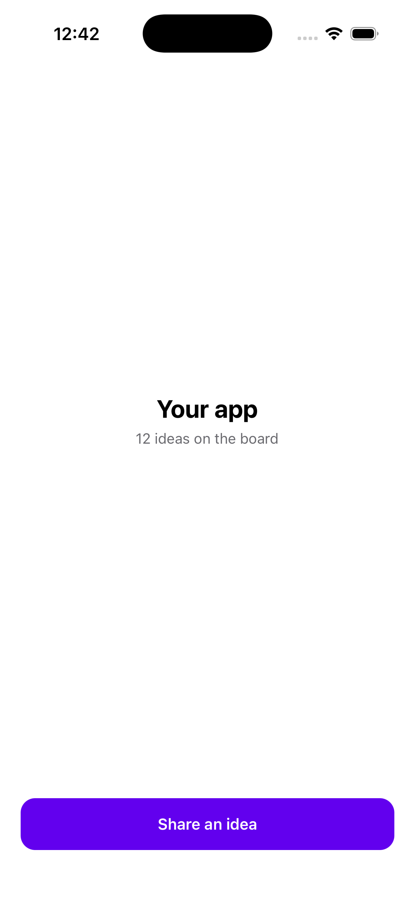

<p align="center">
  
</p>

<h1 align="center">expo-feedback-ai</h1>

<p align="center">
  <b>Let your users' feedback build your $1M app with AI.</b>
</p>

<p align="center">
  One component. Your users ask for features and vote.<br>
  Your AI agent reads the ranked list from a URL and ships the winners.
</p>

<p align="center">
  <a href="https://www.npmjs.com/package/expo-feedback-ai"></a>
  
  
  
  
</p>

<p align="center">
  by <a href="https://BinniCordova.com"><b>BinniCordova.com</b></a>
</p>

---

## 60 seconds to a live idea board

```bash
npx expo install expo-feedback-ai react-native-svg react-native-safe-area-context @react-native-async-storage/async-storage
```

```tsx
import { FeedbAISheet } from 'expo-feedback-ai';

<FeedbAISheet visible={open} onClose={() => setOpen(false)} />
```

That's the whole integration. **No provider, no API key, no signup, no endpoint to
configure, no backend to run.** The module starts itself on first render, identifies
your app by its own bundle id, and ships with a demo feed so the board works before
you've done anything else. Runs in Expo Go — there is no native code to prebuild.

<p align="center">
  
  
  
</p>

<p align="center"><i>Ranked board · two-field composer · instant, offline-safe voting</i></p>

---

## The part that builds the $1M app

Your board is published as **a plain JSON file at a public URL named after your app id**:

```
https://storage.googleapis.com/feedbai.firebasestorage.app/feedbacks/<your.bundle.id>.json
```

```bash
curl https://storage.googleapis.com/feedbai.firebasestorage.app/feedbacks/ai.feedb.example.json
```

No auth, no SDK, no scraping. Which means every AI tool you already use can read what
your users want and start building it:

<p align="center">
  
  
  
  
  
  <br>
  
  
  
  
  
</p>

**Paste this into your coding agent, in your repo:**

> Fetch `https://storage.googleapis.com/feedbai.firebasestorage.app/feedbacks/<your.bundle.id>.json`.
> Take the top 3 items by `likes`, implement them in this codebase, and open a PR for each
> one titled with the idea's `title`.

**Or wire it once in n8n / Zapier / Make:** Schedule → HTTP GET the feed → pick the top
item → hand it to your agent → PR. Your roadmap now runs itself while you sleep.

```jsonc
{ "generatedAt": 1757116800000,
  "items": [{
    "uid": "fb_dark_mode",
    "title": "Dark mode, please",
    "description": "The white screen is blinding at night.",
    "likes": 42,
    "author": "marcus okafor",  // optional — drives the avatar initials
    "agentBuilding": true,      // optional — lights the ✦ badge in the app
    "createdAt": 1756598400000  // optional — "3 weeks ago", and used in ranking
  }] }
```

Flip `agentBuilding` and your users watch their idea move from *asked for* to
*being built*, inside the app, without you writing a changelog.

<p align="center">
  
</p>

| | what happens | who does it |
|---|---|---|
| 1 | A user writes what they wish the app did | your user, in-app |
| 2 | Everyone else votes it up — or doesn't | your users, in-app |
| 3 | Ideas are deduped, classified, spam-rejected | AI, on ingest |
| 4 | An agent writes the code for the winners | **your AI**, from the URL above |
| 5 | It ships, leaves the board, the next ideas rise | your release |

This module is steps 1, 2 and 5 — and the URL that makes 3 and 4 a one-line prompt.

---

## Autopilot: the setup I actually run



Point that URL at a GitHub Action on a 3-day cron, let **Claude Code** build the
top-voted idea, and ship it with **EAS Update** — over the air, **no App Store
review**, because the only thing that ever ships is JavaScript.

The cron matches the cadence the board already promises your users on screen.

It runs **hands off**, in two halves:

- [`feedbai-autopilot.yml`](example/.github/workflows/feedbai-autopilot.yml) — reads
  the board, builds the most-voted ideas that aren't already underway, and **leaves a
  PR**. Each one is marked *being built*, so the ✦ badge lights up next to that idea
  in your app the moment work starts.
- [`feedbai-automerge.yml`](example/.github/workflows/feedbai-automerge.yml) — merges
  those PRs **24 hours later**, then marks them released so they leave the board.

That day-long hold is the design: CI's verdict and a preview QR are on the PR the
whole time, so you *can* look and veto — and if you don't, it ships anyway. Hands off
by default, reviewable by exception.

A user asks on Monday. They are using it on Thursday.

**→ The workflow, the secrets and the OTA safety config:
[docs/AUTOPILOT.md](docs/AUTOPILOT.md)**

<br clear="right">

---

## Why the ranking sells your board

<p align="center">
  
  
</p>

Sort by votes alone and every new idea dies at the bottom unread. So:

```
score = likes + boost × 2 ^ −(age / buildCycle)
```

A newcomer enters with a head start (the 75th percentile of votes already on the
board) that halves each publish cycle — one cycle of real exposure, then it stands on
its own votes. Rows **never jump under a user's finger**: the order settles on mount
and when a new feed lands, not on every tap. Your own unpublished idea pins to the top
reading *"Sent — we're reading it"*.

The subtitle — *"Our AI engineer builds the most-wanted ideas every 3 days"* — is
generated from the same number the ranking uses, so the promise can't drift from the
behaviour.

---

## Make it yours

```ts
initializeFeedbAI({
  theme: {
    primaryColor: '#ff6b35',
    dark: { primaryColor: '#ff8f66', backgroundColor: '#0b0b0e' },
  },
});
```

One colour reaches every surface, in both schemes. The board follows the device into
dark mode on its own; `colorScheme: 'light' | 'dark'` pins it. Every visible string is
a prop (`title`, `subtitle`, `composeLabel`, `titlePlaceholder`, …).

### Components

| | |
|---|---|
| `<FeedbAISheet visible onClose />` | the drop-in: board + composer in a bottom sheet |
| `<FeedbAIComposerSheet visible onClose />` | just the writing sheet |
| `<FeedbAIList />` | the ranked list, for your own screen |
| `<FeedbAIComposer />` | the two fields and the send button |

### Hooks

```ts
const feedbacks = useFeedbacks();           // feed + drafts + optimistic votes
const ready = useFeedbAIReady();            // false until storage has been read
const toggleVote = useToggleVote();         // toggleVote(uid)
const createFeedback = useCreateFeedback(); // createFeedback({ title, description })
await refreshFeedbAI();                     // pull-to-refresh: push + re-download now
```

---

## Built to be invisible in your app

- **Zero native code.** Nothing to prebuild, nothing to rebuild, works in Expo Go.
- **Offline-safe.** A vote applies instantly and queues; a killed app loses nothing,
  and a retry can never double-count.
- **Quiet.** First sync waits for the app to go idle. Feed and queue move hourly, in
  the foreground only. The device talks to a server only when it has something to say.
- **No collisions.** Its own jotai store, its own storage namespace, its own
  `SafeAreaProvider`, no sheet library dragged into your bundle.
- **Peer dependencies, not copies** — it uses the `react-native-svg` you already have.

Running your own backend instead? Four small functions — three write endpoints and
a cron that publishes one static JSON per app — in
[example/functions/index.js](example/functions/index.js). Free tier at 10k DAU.

## Try it

```bash
cd example && bun install && bun start
```

<p align="center">
  
</p>

---

<p align="center">
  Built by <b><a href="https://BinniCordova.com">BinniCordova.com</a></b> — Binni Cordova<br>
  <i>If this module ends up building features for your app while you sleep, that was the whole point.</i>
</p>
