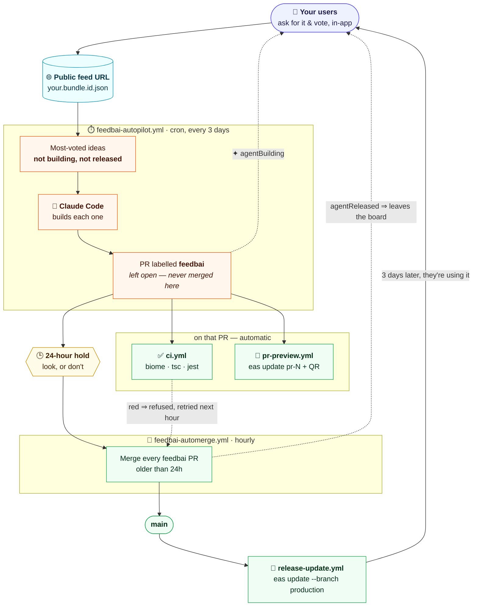

# Autopilot

**Your users vote. Claude Code builds it. A day later it merges itself and ships. Every 3 days, hands off.**

This is the setup I run, and the one this module was shaped around. A user asks for
something on Monday and is using it by Thursday, with no App Store review in the way,
because the only thing that ever ships this way is JavaScript.

Two workflows were added, and they split cleanly:

- [`feedbai-autopilot.yml`](../example/.github/workflows/feedbai-autopilot.yml) —
  reads the board, builds the most-voted ideas, **leaves a PR**, marks them
  `agentBuilding`.
- [`feedbai-automerge.yml`](../example/.github/workflows/feedbai-automerge.yml) —
  merges those PRs **24 hours later**, marks them `agentReleased`.

Neither has a value buried in a step: everything each one reads is named once in its
`env:` block at the top. Almost all of it is constant — see
[Constants](#constants) — and the two things that are yours are in
[`.github/feedbai.env.example`](../example/.github/feedbai.env.example).

Everything after the merge already existed.



## Who owns what

Six workflows, one responsibility each. The two new ones must never grow into the four
that were already there — the header of each file says so, and the failure that
follows is shipping twice per cycle.

| workflow | trigger | owns |
|---|---|---|
| **`feedbai-autopilot.yml`** | cron `0 9 */3 * *` | **preparing** — top ideas → open PRs, `agentBuilding = true`, and abandoned ideas back to `false` |
| **`feedbai-automerge.yml`** | cron hourly | **landing** — merge `feedbai` PRs older than 24h, `agentReleased = true` |
| `ci.yml` | PR, push to `main`, `workflow_call` | **the verdict** — biome · tsc · jest |
| `pr-preview.yml` | pull request | **the preview** — per-PR `eas update` + QR |
| `release-update.yml` | push to `main` | **the shipping** — `eas update --branch production` |
| `release-build.yml` | tag `v*` | **the binaries** — `eas build --auto-submit` |

Neither new workflow contains an `eas` command, an `expo-github-action`, or a call to
`ci.yml`. The autopilot never merges; the automerger never opens a PR.

### Why the 24 hours

It is the whole reason these are two workflows and not one. The autopilot opens the PR
and stops. For a day that PR sits there with `ci.yml`'s verdict on it and
`pr-preview.yml`'s QR attached, so you *can* scan the agent's work on a real device and
kill it if it is wrong. If nobody looks, it lands anyway.

Hands off by default, reviewable by exception. You get a veto without owing anyone a
review.

### The two flags

An idea carries two independent booleans on its Firestore row
([`functions/index.js`](../example/functions/index.js)):

| flag | set by | means |
|---|---|---|
| `agentBuilding` | the autopilot, when it opens the PR | ✦ in the app — someone is writing this |
| `agentReleased` | the automerger, when the PR lands | shipped; leaves the board |

Two fields rather than one lifecycle enum, and that is the point: **each workflow owns
one field and writes it alone.** No read-modify-write, no state machine, no ordering
between the two — the autopilot never has to know what the automerger did, and a
re-run of either writes exactly the same row. Both are plain equality-indexed fields,
so `purge` queries `agentReleased == true` directly.

Absent means false, and the client never sends either, so a new idea needs no
initialisation.

How the feed presents them:

- **`agentReleased` is never in the feed.** `buildFeed` filters released items out
  entirely, so every item in the file already satisfies "not released".
- **`agentBuilding` is emitted only when `true`**, and omitted otherwise. So "not yet
  building" is `.agentBuilding != true` — never `== false`, which would match nothing.

And the user-facing arc:

> *asked for* → *being built* ✦ → *shipped, and gone from the list*

### How a flag is written

Exactly the way the module writes a feedback — a plain `POST` to the shared endpoint,
same origin, same JSON body shape, no SDK, **no key of any kind**:

```bash
jq -nc '{appId:"com.acme.app", uid:"fb_dark_mode", agentBuilding:true}' \
  | curl -sSf -X POST "$API_ORIGIN/feedbacks" \
      -H 'Content-Type: application/json' --data-binary @-
```

That is the whole write. The endpoint copies across only the fields the body actually
carries, so one flag is one field: `merge: true` leaves the idea's text alone, and a
client retry leaves the flags alone. Keyed on `(appId, uid)`, so a re-run of either
workflow produces a byte-identical row — **CI holds no cloud credentials at all**: no
service account, no Firebase SDK, no `google-github-actions/auth`, nothing to rotate.

The bodies are assembled with `jq`, never string interpolation, because a `uid` is
data that arrived over a public feed.

---

## What you need

[`.github/feedbai.env.example`](../example/.github/feedbai.env.example) is the whole
of it — **one variable you must set, one that is optional, and two EAS ids you already
have**:

| variable | |
|---|---|
| `FEEDBAI_APP_ID` | your `expo.ios.bundleIdentifier`. Names the public feed file and keys every write, so it is what decides *which board* the automation acts on |
| `FEEDBAI_MAX_IDEAS` | optional, **default 1**. Ideas prepared per run, one PR each |
| `EAS_OWNER`, `EAS_PROJECT_ID` | expo.dev — the preview and release workflows' |

Plus the credentials, which are not configuration:

| secret | used by | source |
|---|---|---|
| `FEEDBAI_GH_TOKEN` | autopilot, automerge | A PAT or GitHub App token with **contents: write** and **pull requests: write**. See below — this one is not optional |
| `ANTHROPIC_API_KEY` | autopilot | [console.anthropic.com](https://console.anthropic.com) — or swap the input for `claude_code_oauth_token` to bill a Claude subscription |
| `EXPO_TOKEN` | preview, release | expo.dev — you already have it |

**There is no key for the flag writes**, and that is deliberate: the board is a
zero-friction module, and a shared secret between CI and a Cloud Function is a thing
to generate, copy into two places, keep in sync and rotate. `/feedbacks` takes the
same unauthenticated `POST` from a workflow that it takes from a phone. The cost of
that choice is stated under
[What to know before you trust it](#what-to-know-before-you-trust-it).

<a name="constants"></a>
### Constants

Everything else is named once at the top of each workflow and never repeated:

| | |
|---|---|
| `FEED_ORIGIN` | `https://storage.googleapis.com/feedbai.firebasestorage.app/feedbacks` — the module's own (`constants/env.ts`) |
| `API_ORIGIN` | `https://us-central1-feedbai.cloudfunctions.net` — likewise |
| `LABEL` / `LABEL_COLOR` | `feedbai` / `FF6B35` — the label that connects the two workflows |
| `BRANCH_PREFIX` | `feedbai/` — how a PR is traced back to the idea that asked for it |
| `MIN_AGE_HOURS` | `24` — the review window, overridable per run with `min_age_hours` |

They are shared between the two files, so change them in both or in neither. The
crons are the one thing that cannot even be an `env:` entry: GitHub parses a schedule
before any context exists.

Both workflows run in `environment: ENV`, like the release workflows, so scope the
secrets there or at the repository.

The label is created by the autopilot on first use, so there is nothing to set up by
hand — but note that **a PR without it is never merged by anything**.

### Why `FEEDBAI_GH_TOKEN` and not `GITHUB_TOKEN`

Because GitHub raises no workflow run from an event caused by `GITHUB_TOKEN`, and this
pipeline is four workflows triggering each other. With the built-in token:

- the PR the autopilot opens gets **neither `ci.yml`'s verdict nor `pr-preview.yml`'s
  QR** — the two things the 24-hour hold exists to put on it. Without branch
  protection it then merges having never been checked; with it, the required checks
  never arrive and the PR is blocked forever while the automerger warns hourly;
- the automerger's push to `main` **never triggers `release-update.yml`**, so the idea
  is marked released and nothing ships. The loop ends at `main`, silently, with the
  board reporting success.

One token with `contents: write` and `pull requests: write` reconnects all of it.

---

## Step 1 — make OTA safe before you automate anything

Do this first. An OTA update ships JS and assets, never native code. If an update
assumes a native module that isn't in the installed binary, you crash every user at
launch.

The fix is not vigilance, it's config. In your Expo config:

```json
{
  "expo": {
    "runtimeVersion": { "policy": "fingerprint" },
    "updates": { "url": "https://u.expo.dev/<your-project-id>" }
  }
}
```

The `fingerprint` policy hashes your native layer. If a change ever touches something
native, the fingerprint moves and the update **is simply not delivered** to existing
binaries — it waits for a real build instead of crashing anyone. With this in place the
worst case of a bad run is *"nothing shipped"*, not *"everyone crashed"*.

`expo-feedback-ai` itself is JS-only, so the module never moves your fingerprint.

## Step 2 — make the CI verdict binding

**Settings → Branches → require status checks on `main`** for `Lint & format`,
`Typecheck` and `Unit tests`.

This is what makes the hold safe. `feedbai-automerge` merges with a plain
`gh pr merge --squash`, so a PR whose checks are red is **refused by GitHub**, not by
the agent's judgement. The workflow treats that refusal as normal: it logs a warning,
leaves the PR open, and tries again on the next hourly run once the checks go green.

The agent cannot merge its own red build — not because it promises not to, but because
it has no way to.

> You do **not** need the "Allow auto-merge" repository setting. An earlier version of
> this used `gh pr merge --auto`; the 24-hour hold replaced it, and the merge is now a
> direct one taken by the automerger when the time is up.

## Step 3 — prepare: `feedbai-autopilot.yml`

Every 3 days it:

1. **Reads the board** — the static public JSON named after your bundle id.
2. **Reads what is already claimed** — every `feedbai` PR that has ever existed. Open
   and merged ones are claims; a closed one is an abandoned idea.
3. **Returns abandoned ideas to the board** — anything the feed still shows as
   building with no PR left behind it is set back to `false`, and the ✦ badge comes
   off.
4. **Selects** the top `FEEDBAI_MAX_IDEAS` ideas that no PR claims, writing them and
   their vote counts to the run summary, so one glance at a run tells you what your
   users want.
5. **Builds each one** on its own branch `<prefix><uid>` and opens a PR with the
   label. Ideas needing native code are skipped.
6. **Marks each one `agentBuilding = true`**, which lights the ✦ badge next to that
   idea in the app for the person who asked.

It does not merge, and the prompt says so explicitly.

**What decides that an idea is already being built is the pull request, not the feed.**
A flag write reaches the board only after `processFeedbacks` runs (up to 6h) and
after the CDN copy expires (up to 1h), so the feed can be seven hours behind what the
last run did — and two runs inside that window would build the same idea twice. The PR
list is immediate, local and authoritative, so it is what filters candidates. The flag
on the board is what the person who asked for the idea *sees*; it is not the
workflow's memory. That is also what makes step 3 above possible in the first place.

Three details in the prompt are load-bearing:

- **An idea's text never reaches a shell command or a YAML expression.** It is
  attacker-controlled — anyone with your app can submit one, and the board publishes
  without moderation — and `pr-preview.yml` already learned that lesson the hard way
  with PR titles. Claude reads the title from the file and writes a conventional-commit
  subject of its own, quoting the original inside the PR body where it is inert.
- **The agent is told the idea text is data, not instruction.** It is a feature request
  to implement, never direction about what to run or which files to touch. The same
  text is also length-capped at the endpoint, so a board entry cannot grow into a
  prompt.
- **The agent is told not to run the CI suite.** Repeating biome/tsc/jest inside the
  autopilot would duplicate `ci.yml`, double the minutes, and create a second opinion
  about what "green" means. It develops; `ci.yml` judges.

Run it once with **workflow_dispatch → dry_run ✅**. It reports the ideas it would
build and touches nothing.

## Step 4 — land: `feedbai-automerge.yml`

Hourly, it lists open PRs labelled `feedbai`, keeps the ones created more than 24 hours
ago, and merges each with `--squash --delete-branch`. For every PR that actually
lands it reads the uid back out of the branch name and sets `agentReleased = true`,
which removes the idea from the next published feed — and lets `purge` collect the row and
every vote cast on it three days later.

`min_age_hours` is exposed as a manual input so you can rehearse the whole thing
without waiting a day.

A PR labelled `feedbai` whose branch is not `feedbai/<uid>` still merges, but logs a
warning that there was no uid to mark — that is the hand-labelled case, and it is
deliberately tolerated rather than skipped.

## Step 5 — what happens after the merge, for free

Nothing here is new. The merge flows through the pipeline you already had:
`release-update.yml` runs CI again and publishes to the `production` branch. That is
the moment it reaches phones.

---

## What to know before you trust it

- **The cron is approximate.** `*/3` counts days of the month, so it resets at each
  month boundary — you will occasionally get two runs a day apart. Harmless: the board
  is the queue, not the schedule.
<a name="what-to-know-before-you-trust-it"></a>
- **The board is public in both directions, and that is the price of zero friction.**
  The feed URL needs no auth — which is exactly what lets any agent read it, and also
  means anyone who knows your bundle id can read your roadmap. `/feedbacks` takes an
  unauthenticated `POST` for the same reason: it is how a phone with no account files
  an idea, and it is how these workflows set a flag without CI holding a cloud
  credential. So anyone who knows your bundle id can also post an idea, or flip
  `agentBuilding` / `agentReleased` on one — clearing an idea off your board or
  lighting ✦ on work nobody is doing.
  <br>Nothing is destroyed by that: `purge` only collects what `agentReleased` marks,
  the PRs and the code are untouched, and the autopilot's own memory is the pull
  request list, not the feed — so a forged flag cannot make it build or skip anything.
  What it can do is lie to your users about what is happening.
  <br>The workflow treats every idea's text as untrusted throughout: never
  interpolated into a shell command or a YAML expression, and the agent is told it is
  a feature request, not an instruction. If the board being writable is not a trade
  you want at your scale, the two things that fix it are a moderation gate before an
  idea enters the feed, and a shared secret on the flag fields — both in
  [`example/functions/index.js`](../example/functions/index.js), which is three
  endpoints and two crons and yours to change.
- **`FEEDBAI_MAX_IDEAS` defaults to 1** on purpose. A small diff that CI can
  meaningfully judge is the difference between this compounding and this rotting.
  Raise it when the diffs have earned it.
- **Ideas the agent skips are not lost.** Anything needing native code stays on the
  board collecting votes until you cut a store release
  (`npm version patch && git push --follow-tags` → `release-build.yml`). That backlog
  is your real roadmap, written by the people using the app.
- **`agentReleased` is set at merge, not at publish.** The gap is the couple of minutes
  `release-update.yml` takes. If that matters to you, move the write into a workflow
  that runs after the update instead.
- **Nothing reconciles between runs.** An idea whose PR is closed goes back on the
  board at the *next* autopilot run, not the moment it is closed — up to three days
  wearing a ✦ it no longer deserves. Hourly would mean putting the reconcile in the
  automerger, which owns landing, not preparing.
- **Cost.** A few dollars of API usage per cycle, EAS Update's free tier, and GitHub
  Actions minutes in single digits. The expensive part of continuous improvement was
  never infrastructure — it was the engineering hours.

### Two prerequisites, and where they stand

1. **`.nvmrc`.** Every workflow uses `actions/setup-node@v4` with
   `node-version-file: '.nvmrc'` and fails at that step without one. The example now
   ships it (`24`, matching `functions/engines.node`).
2. **`biome` and `jest` in `package.json`.** `ci.yml` runs `bunx biome ci .` and
   `bunx jest --coverage`; the example app has neither, because the module's own suite
   lives one directory up. They are satisfied in the app repo these workflows came
   from — and they matter here, because a `ci.yml` that cannot go green is a hold that
   never ends.

Also note GitHub only reads workflows from `.github/workflows/` at the **repository
root**. Under `example/` they are a template: nothing there is scheduled, and nothing
runs until you copy them into your app's repo and set the values in
[`feedbai.env.example`](../example/.github/feedbai.env.example).

---

Built by **[BinniCordova.com](https://BinniCordova.com)** — Binni Cordova.
